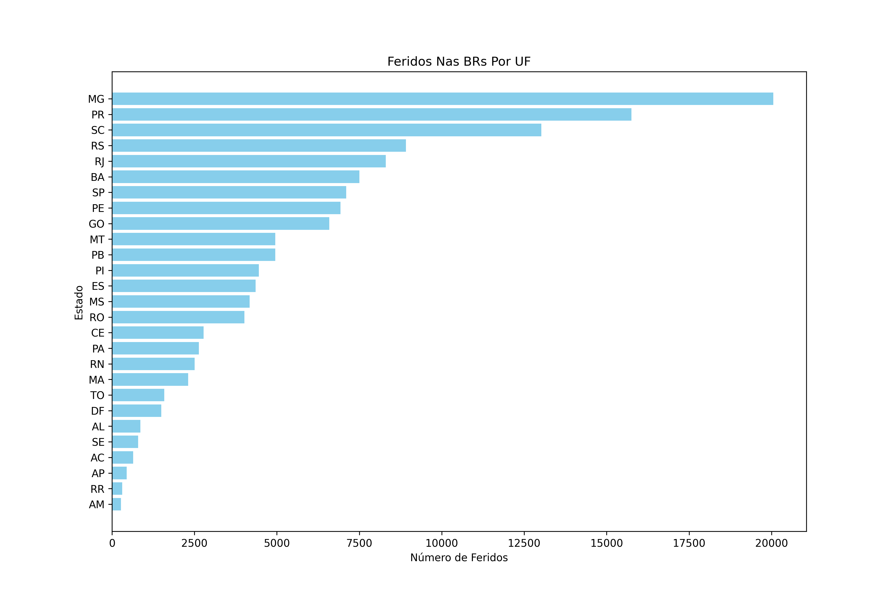
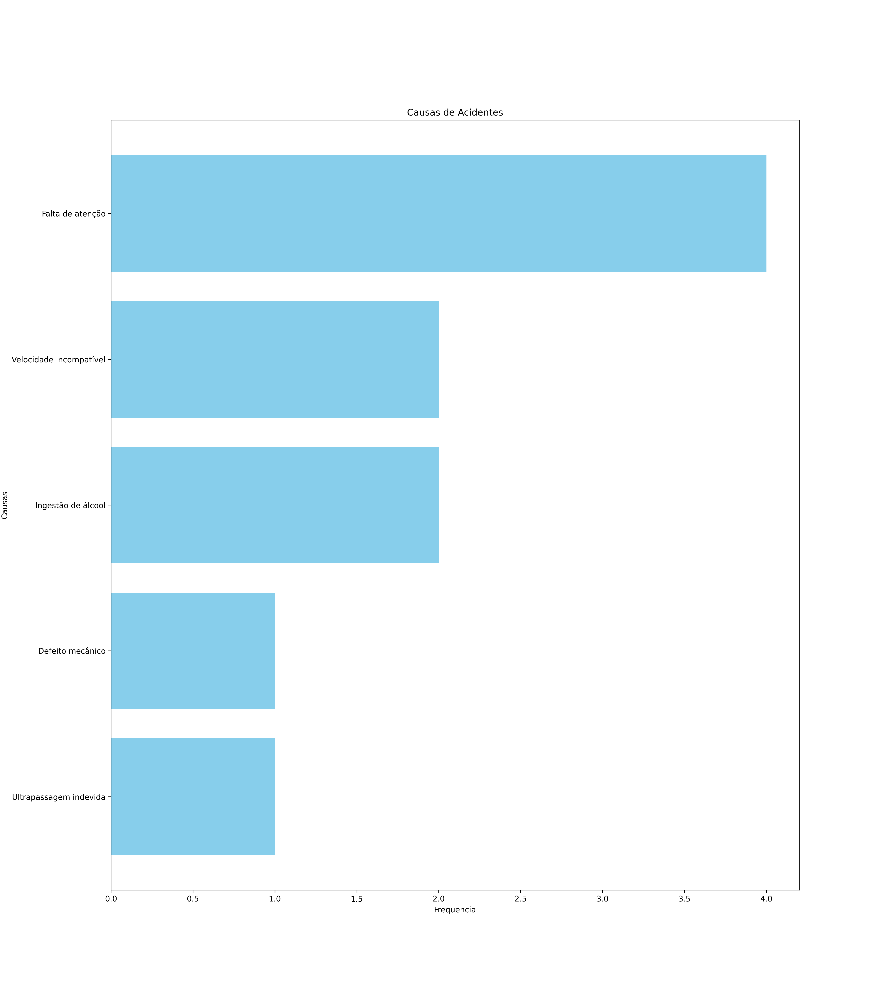
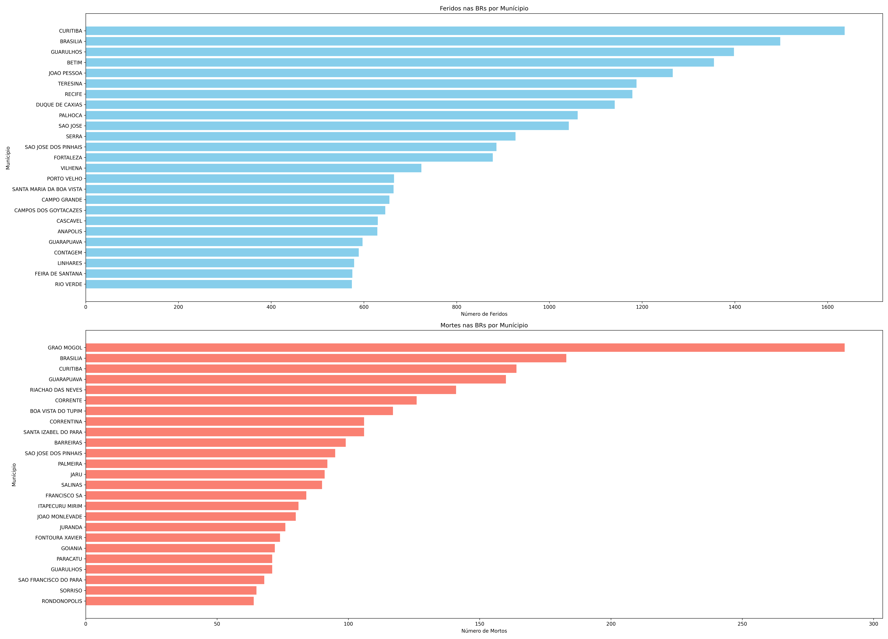
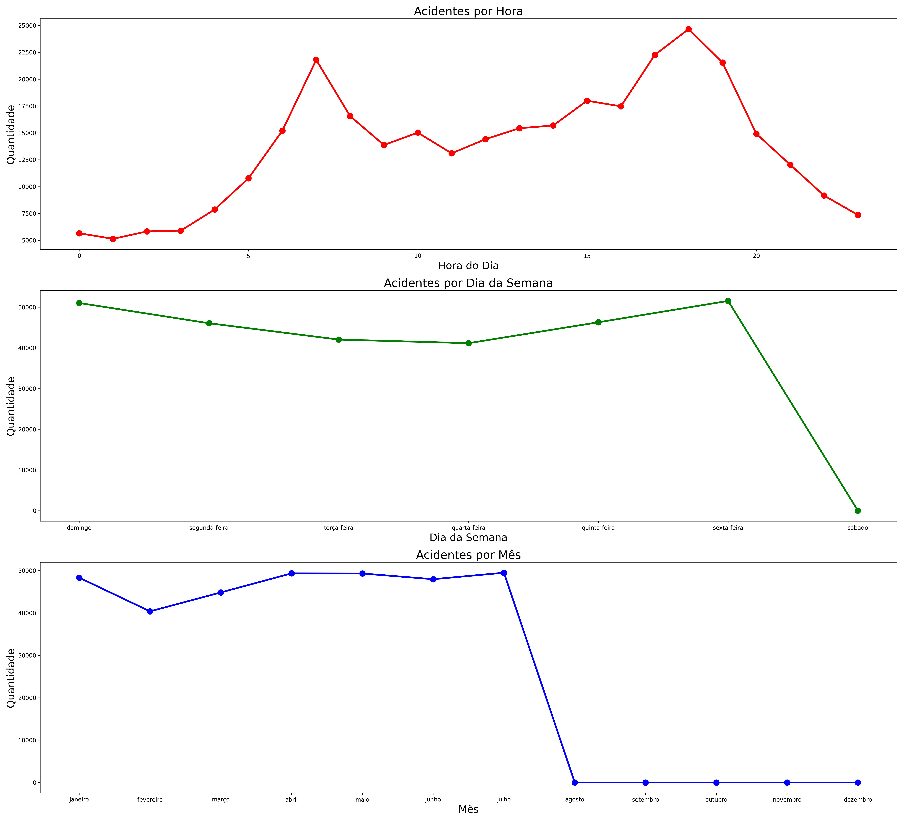
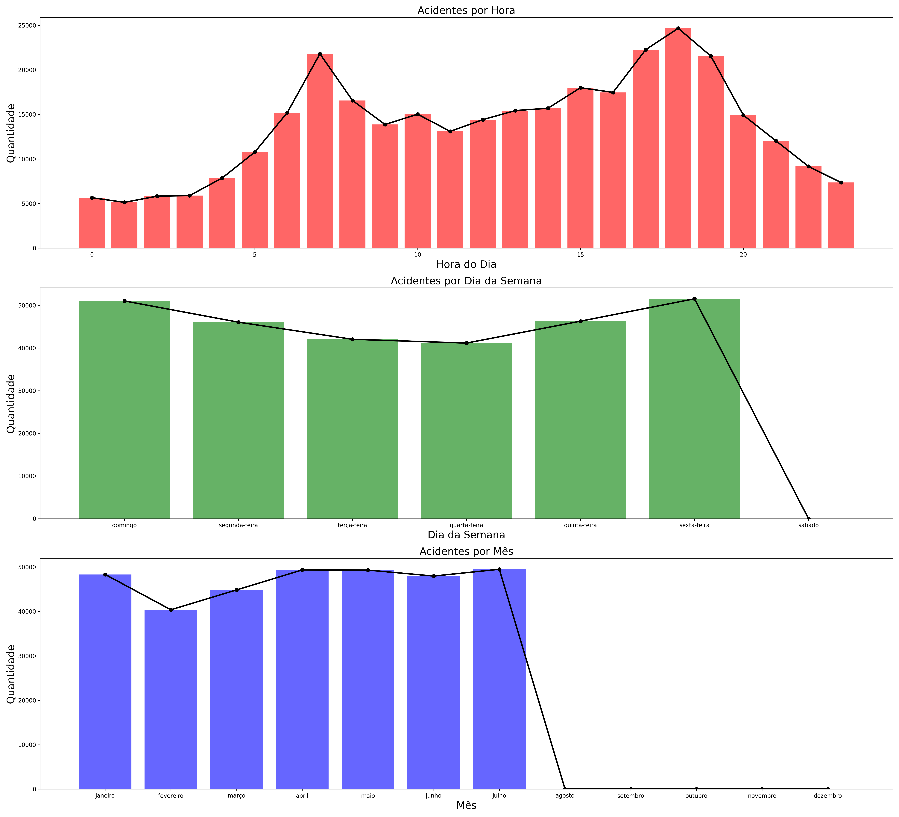
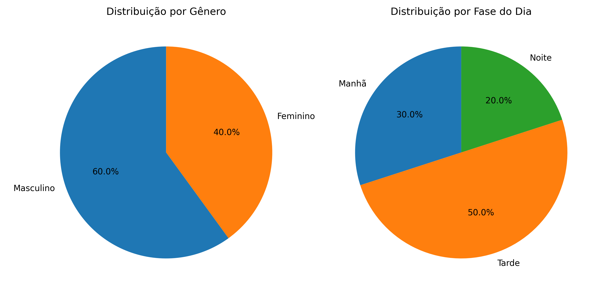

# 📊 Análise de Acidentes nas Rodovias Federais (BRs)

Este projeto tem como objetivo analisar os acidentes ocorridos nas
rodovias federais brasileiras, identificando padrões, causas e impactos,
tanto em número de **feridos** quanto de **mortos**.\
A análise foi feita a partir de dados públicos, utilizando **Python** e
bibliotecas de análise de dados e visualização, como **Pandas**,
**Matplotlib** e **Seaborn**.

------------------------------------------------------------------------

## 🔍 Objetivos

-   Identificar as rodovias (BRs) mais perigosas em termos de feridos e
    mortos.\
-   Analisar as principais causas de acidentes.\
-   Mapear os estados e municípios mais afetados.\
-   Verificar padrões temporais (hora, dia da semana e mês).\
-   Avaliar distribuição por gênero e período do dia.

------------------------------------------------------------------------

## 📈 Gráficos e Insights

### 🚧 Rodovias com mais acidentes

-   **BR-101** e **BR-116** aparecem como as mais críticas, liderando
    tanto em feridos quanto mortos.\
    

------------------------------------------------------------------------

### ⚠️ Causas de Acidentes

As principais causas estão relacionadas ao comportamento dos
motoristas:\
- **Velocidade incompatível**\
- **Falta de atenção / reação tardia**\
- **Ingestão de álcool**\
- **Ultrapassagem indevida**

------------------------------------------------------------------------

### 🏙️ Impacto por Município e Estado

-   Estados com mais feridos: **MG, PR, SC e RS**.\
-   Municípios como **Curitiba, Brasília e Guarulhos** concentram mais
    feridos.\
-   Já em número de mortos, **Grão Mogol (MG)** aparece como destaque
    negativo.

\

------------------------------------------------------------------------

### ⏱️ Padrões Temporais

-   **Horas de pico:** maior número de acidentes entre **6h e 8h** e
    entre **17h e 20h**.\
-   **Dias da semana:** aumento na **sexta-feira**.\
-   **Meses:** maior concentração de acidentes no **primeiro semestre**.

\

------------------------------------------------------------------------

### 👥 Perfil das Vítimas

-   **Gênero:** 60% masculino e 40% feminino.\
-   **Período do dia:** 50% à tarde, 30% de manhã e 20% à noite.

------------------------------------------------------------------------

## 🛠️ Tecnologias Utilizadas

-   **Python 3.11+**\
-   **Pandas** (análise de dados)\
-   **Matplotlib / Seaborn** (visualização)\
-   **Jupyter Notebook** (`TimeAnalytics.ipynb`)

------------------------------------------------------------------------

## 📂 Estrutura do Projeto

    ├── fig/
    │   ├── causas_acidentes.png
    │   ├── feridos_municipios.png
    │   ├── feridos_uf.png
    │   ├── grafico_linhas.png
    │   ├── grafico_linhas_barras.png
    │   ├── municipio.png
    │   └── pct_genero_fase_dia.png
    ├── TimeAnalytics.ipynb
    └── README.md

------------------------------------------------------------------------

## 🚀 Conclusão

A análise mostra que os acidentes nas rodovias brasileiras estão
fortemente ligados a **falhas humanas**, com destaque para **velocidade
excessiva, falta de atenção e álcool**. Além disso, há concentração em
**algumas BRs específicas**, o que pode orientar políticas públicas de
**fiscalização e prevenção**.
